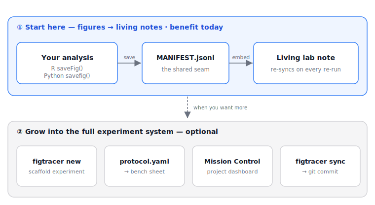

# figtracer

[](https://opensource.org/licenses/MIT)

**Git-tracked lab notes whose figures come from your code — in R and Python.**

*A command-line toolkit that threads every figure your analysis produces into a plain-text,
version-controlled lab note. Drop it into the analysis you already have — or adopt the whole
experiment-scaffolding system on top.*

## The problem

You run the whole pipeline — cluster, annotate, forty figures — drop them into your lab notes,
and move on. A week later a collaborator mentions that one sample was mislabelled. You fix one
line and re-run everything… and now every figure in your notes is silently out of date. So you
re-export and re-paste them by hand, one by one, hoping you didn't miss any.

**figtracer makes that update disappear.** Every figure is tied to the code and the exact git
commit that produced it, so when the analysis re-runs, your notes re-sync themselves. Fix the
label, re-run, done — the figures *and* the record of where each one came from update on their
own. No re-pasting, nothing silently stale.

## How it works

It rests on one small contract. Each time you save a figure — from R or Python — one line is
appended to an append-only `MANIFEST.jsonl`: the figure's title, size, source file, and the exact
git commit at that moment. figtracer then resolves figures by title, embeds them into a Markdown
note with a provenance table, and re-syncs that note whenever you re-run — so the note is a
*derived view* of your analysis, never a hand-duplicated copy. Everything lives as plain text in git.



Start with the figure loop — one function call in the analysis you already have. Reach for the
rest of the system (experiment scaffolding, protocols, dashboard, close-the-loop `sync`) only if
and when you want it.

## Two ways to use it

- **Run it yourself** from the terminal — it's a normal CLI (`figtracer <command>`).
- **Recommended for lab scientists: have [Claude Code](https://claude.com/claude-code) drive it
  for you.** figtracer ships agent instructions (`AGENTS.md`) so an AI coding assistant can
  scaffold your experiment, run the analysis, save figures with provenance, and keep your lab
  notes and dashboard in sync — on your behalf. figtracer was designed to be agent-friendly from
  the start: everything it touches is plain text, a CLI, and git, so you can describe the
  experiment in plain language and let it run the machinery. (A conventional electronic lab
  notebook, being a proprietary GUI, can't be driven this way.)

## Start small — figures → living notes (the wedge)

The one thing to try first. It drops into **any** existing analysis — any directory layout,
R **or** Python, notes in any Markdown tool — with a single function call. No buy-in to the
rest of figtracer.

```r
# R — seekit's saveFig(), or figtracer's bundled dependency-free shim (no seekit needed):
source("path/to/figtracer/r/figtracer.R")
saveFig(p, title = "umap_level1")            # -> a figure + a MANIFEST line
```

```python
# Python / Jupyter — same layout, same MANIFEST contract, no R:
from figtracer import savefig
savefig(fig, title = "umap_level1")          # -> a figure + a MANIFEST line
```

Then the figure is provenance-tracked and the note follows the latest render:

- `figtracer fig embed <spec.yaml>` — compose panels into a figure and write it into a note
  (with a provenance table); `figtracer fig watch` keeps it live.
- `figtracer figsync sync` — keep single note figures in sync with the newest export.
- `figtracer fig doctor` — integrity-check the manifest so a title never resolves to a stale or
  missing figure.

Embeds are **portable by default** (standard Markdown / HTML, so they render anywhere);
`--link-style obsidian` gives Obsidian wikilinks with the native resize handle.

**See it on real public data:** [`examples/cytof`](examples/cytof) analyses two public CyTOF
datasets — one in R (`seekit`), one in Python (`scanpy`) — and threads figures from **both**
into one lab note. That is the whole idea, end to end, on data anyone can download.

## Go further — the full experiment system (opt-in)

If you want more than the figure loop, figtracer is also a complete, plain-text experiment
manager. None of this is required to use the wedge above.

```
figtracer new       scaffold a fully cross-linked experiment: notes + data/analysis/outputs dirs
figtracer index     rebuild a project's Mission Control dashboard (every experiment by status)
figtracer protocol  render a bench protocol.yaml -> a printable sheet + a Markdown shadow
figtracer data      a content-addressed registry of analysis objects (.qs2/.rds/.RData)
figtracer sync      end-of-session roundup: figures -> note -> dashboard -> git commit
figtracer export    a clean collaborator-facing PDF of an experiment's notes
```

`labkit` (scaffolding + Mission Control) and `figtools` (figure assembly) also ship as
standalone console scripts; `figtracer` is a convenience front door over them.

## How figtracer compares

figtracer fills a specific gap: **a lab notebook whose figures are generated by your code,
tracked in git, and stay in sync — that you can drop into an existing analysis in one line, or
hand to an AI assistant to run.** It is not a sample/inventory system (LIMS) and does not try to
replace an electronic lab notebook's compliance features; it wins on the *computational* record.

| | figtracer | Commercial ELN (Benchling, LabArchives) | Open-source ELN (eLabFTW) | Evernote / Notion | PowerPoint | Literate docs (Quarto, Jupyter) |
|---|---|---|---|---|---|---|
| Record format | plain-text Markdown/YAML in **git** | proprietary cloud DB | DB / self-host | proprietary | proprietary binary | rendered document |
| **Figures ↔ code** | **linked to source file + commit, auto-resync** | detached upload | detached upload | manual paste (goes stale) | manual paste (goes stale) | inline, same document only |
| **Cross-language (R + Python)** | **both → one note** | — | — | — | — | one language per document |
| **Fits your existing analysis** | **one function call, any layout** | no (separate app) | no (separate app) | no (separate app) | no (separate app) | restructure into notebooks |
| **Agent-operable** | **yes — ships `AGENTS.md`** | no (proprietary GUI) | no | no | no | partial |
| Version control | native git, everything | app-internal, lossy export | app-internal | none / manual | none | the document only |
| Cost / lock-in | free, MIT, no lock-in | subscription, vendor-owned | free / self-host | freemium | licensed | free |

The bold rows are where figtracer is unique: **code↔figure provenance that resyncs, across R and
Python, dropped into the workflow you already have, and operable by an AI assistant.** Evernote,
Notion and PowerPoint are where a lot of lab figures actually live today — pasted in by hand,
with no link back to the code and no version history; that is exactly the gap figtracer closes.

## Install (for use)

```bash
pipx install "git+https://github.com/david-priest/figtracer.git"
figtracer init --vault-root "/path/to/your/Obsidian/LabNotes"   # one-time, per machine
```

Update later with `pipx upgrade figtracer`. Data dirs (journal profiles, note templates) ship
inside the wheel. **New here? Start with the [10-minute getting-started guide](docs/GETTING_STARTED.md).**

## Install (development)

```bash
cd figtracer
python3 -m venv .venv && source .venv/bin/activate
pip install -e ".[dev]"
pytest
```

## Layout

```
figtracer/      umbrella package (cli, sync, protocol, savefig, data, export)
labkit/        experiment scaffolding + Mission Control + ingest   (+ templates/, config/)
figtools/      figure assembly, embed, doctor                      (+ config/journals.yaml)
r/             figtracer.R — the dependency-free R saveFig() shim
examples/      runnable public-data example (cytof: R + Python -> one note)
docs/          getting-started + protocol docs
```

## License

MIT — see [`LICENSE`](LICENSE).

## Acknowledgements

Developed in the Wing Lab at the Center for Infectious Disease Education and Research
(CIDER), Osaka University.
