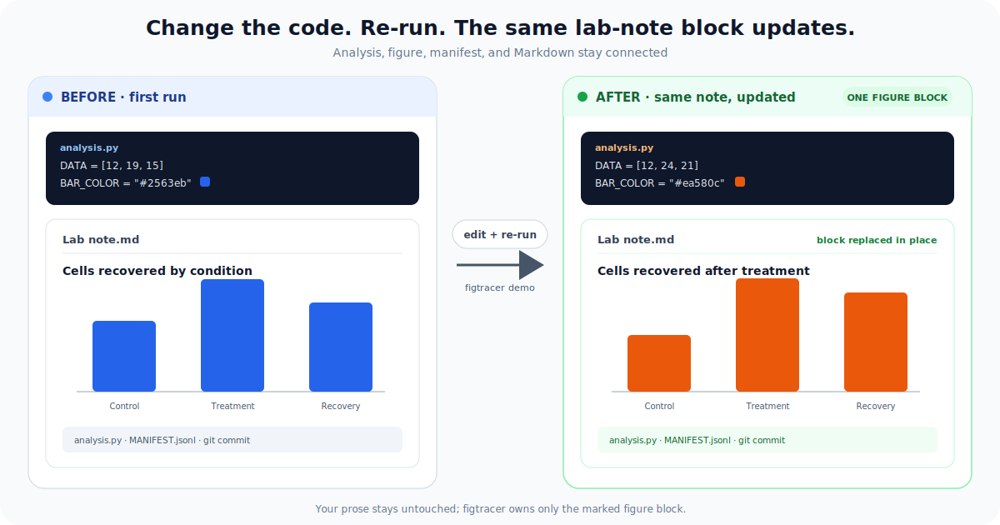

# figtracer

[](https://doi.org/10.5281/zenodo.21288980)
[](https://opensource.org/licenses/MIT)
[](https://github.com/david-priest/figtracer/actions/workflows/ci.yml)

**Change the code. Re-run. Your lab note updates itself.**

figtracer is a Git-native figure-to-note loop for R and Python. It connects each rendered
figure to its analysis source and commit, then keeps one figure block in a plain Markdown lab
note current—without copy-pasting screenshots.

```bash
uv tool install "git+https://github.com/david-priest/figtracer.git"
figtracer demo
```

Open `figtracer-demo/Lab note.md`, edit the generated `analysis.py`, and run `figtracer demo`
again. The figure changes and the existing note block is replaced in place. The first run needs
no configuration, Obsidian vault, project registry, R, external dataset, Chrome, or Matplotlib.



[Take the five-minute tour](docs/GETTING_STARTED.md) or inspect the frozen
[`examples/minimal`](examples/minimal) output.

## How it works

It rests on one small contract. Each time you save or register a figure — from R, Python, or an
external renderer — one line is appended to an append-only `MANIFEST.jsonl`: the figure's title,
size, source file, generator, and the exact git commit at that moment. figtracer then resolves
figures by title, embeds them into a Markdown note with a provenance table, and re-syncs that note
whenever you re-run — so the note is a *derived view* of your analysis, never a hand-duplicated
copy. Everything lives as plain text in git.


Start with the figure loop — one function call in the analysis you already have. Reach for the
rest of the system (experiment scaffolding, protocols, dashboard, close-the-loop `sync`) only if
and when you want it.

## Start small — figures → living notes (the wedge)

The one thing to try first. It drops into **any** existing analysis — any directory layout,
R **or** Python, notes in any Markdown tool — with a single function call. No buy-in to the
rest of figtracer.

```r
# R — seekit's saveFig(), or figtracer's bundled dependency-free shim (no seekit needed):
source("path/to/figtracer/r/figtracer.R")
saveFig(p, title = "umap_level1")            # -> a figure + a MANIFEST line
```

```python
# Python / Jupyter — same layout, same MANIFEST contract, no R:
from figtracer import savefig
savefig(fig, title = "umap_level1")          # -> a figure + a MANIFEST line
```

```bash
# Existing SVG/PDF/PNG — preserve its source and generator in the same contract:
figtracer fig register method_flow.svg --title fixation_method_flow \
  --source-kind generated-svg --generator "python render_method_flow.py"
```

Then the figure is provenance-tracked and the note follows the latest render:

- `figtracer fig embed <spec.yaml>` — compose panels into a figure and write it into a note
  (with a provenance table); `figtracer fig watch` keeps it live.
- `figtracer figsync sync` — keep single note figures in sync with the newest export.
- `figtracer fig doctor` — integrity-check the manifest so a title never resolves to a stale or
  missing figure.

Embeds are **portable by default** (standard Markdown / HTML, so they render anywhere);
`--link-style obsidian` gives Obsidian wikilinks with the native resize handle. A Python analysis
must have `figtracer` installed in its own environment; command-line tools installed by `uv tool`
are intentionally isolated.

**See it on real public data:** [`examples/cytof`](examples/cytof) analyses two public CyTOF
datasets — one in R (`seekit`), one in Python (`scanpy`) — and threads figures from **both**
into one lab note. That is the whole idea, end to end, on data anyone can download.

## Go further — the full experiment system (opt-in)

If you want more than the figure loop, figtracer can also scaffold experiments, render bench
protocols, maintain a Mission Control dashboard, and close out a session. None of this is
required for the five-minute demo or the save-side figure seam.

```text
figtracer new       scaffold a fully cross-linked experiment: notes + data/analysis/outputs dirs
figtracer index     rebuild a project's Mission Control dashboard (every experiment by status)
figtracer protocol  call an experiment-local renderer for protocol.yaml (legacy wrapper)
figtracer data      a content-addressed registry of analysis objects (.qs2/.rds/.RData)
figtracer doctor    profile-aware QMD checks for internal, collaborator, and publication views
figtracer sync      end-of-session roundup: figures -> note -> dashboard -> git commit
figtracer export    a clean collaborator-facing PDF of an experiment's notes
```

Follow the [full experiment-system setup](docs/FULL_SYSTEM.md) when you want that layer. The
current protocol command is a bring-your-own-renderer wrapper; packaging a general protocol
renderer remains future work.
`labkit` (scaffolding + Mission Control) and `figtools` (figure assembly) also ship as standalone
console scripts; `figtracer` is a convenience front door over them. The
[analysis doctor](docs/ANALYSIS_DOCTOR.md) gives humans, agents, and CI a named, suppressible
checklist while keeping one detailed internal QMD as the source of truth.

## When figtracer fits

figtracer is a good fit when:

- analysis happens in R or Python and figures change as the code changes;
- the durable record should be readable Markdown, YAML, SVG, and JSONL in git;
- figures from multiple scripts or languages need to converge on one note;
- you want to add provenance without moving the analysis into a new notebook platform; or
- stale pasted figures and unclear source files are the recurring problem to solve.

It is not the right primary tool when:

- you need regulated ELN controls, electronic signatures, audit certification, or validated
  compliance workflows;
- you need a LIMS for sample inventory, freezer locations, instruments, or chain of custody;
- your team requires a GUI-only, no-code workflow; or
- the analysis and its notes should not live in files or git.

figtracer can sit beside an ELN or LIMS; it does not claim to replace those systems. Its narrow
job is to keep code-generated figures, provenance, and Markdown notes connected.

## Optional: let a coding agent operate it

Everything figtracer touches is plain text, a documented CLI, and git, so a coding agent can run
the same workflow on your behalf. The repository ships [`AGENTS.md`](AGENTS.md) instructions for
that use. Agent operation is optional: every command and artifact remains directly inspectable
and usable by a person at the terminal.

## Install notes

The quick start installs the CLI with `uv tool`. Update it later with:

```bash
uv tool upgrade figtracer
```

For `from figtracer import savefig`, install the package into the environment that runs your
Python analysis too. See the [five-minute guide](docs/GETTING_STARTED.md) for a local-clone
example.

## Development

```bash
git clone https://github.com/david-priest/figtracer.git
cd figtracer
python3 -m venv .venv
source .venv/bin/activate
pip install -e ".[dev]"
pytest
```

## Layout

```text
figtracer/      umbrella package (CLI, sync, protocol, savefig, data, export)
labkit/         experiment scaffolding + Mission Control + ingest (+ templates, config)
figtools/       figure assembly, embed, and integrity checks
r/              dependency-free R saveFig() shim
examples/       minimal zero-data demo snapshot + public-data CyTOF example
docs/           five-minute start, optional full setup, and subsystem guides
```

## License

MIT — see [`LICENSE`](LICENSE).

## Acknowledgements

Developed in the Wing Lab at the Center for Infectious Disease Education and Research
(CIDER), Osaka University.
