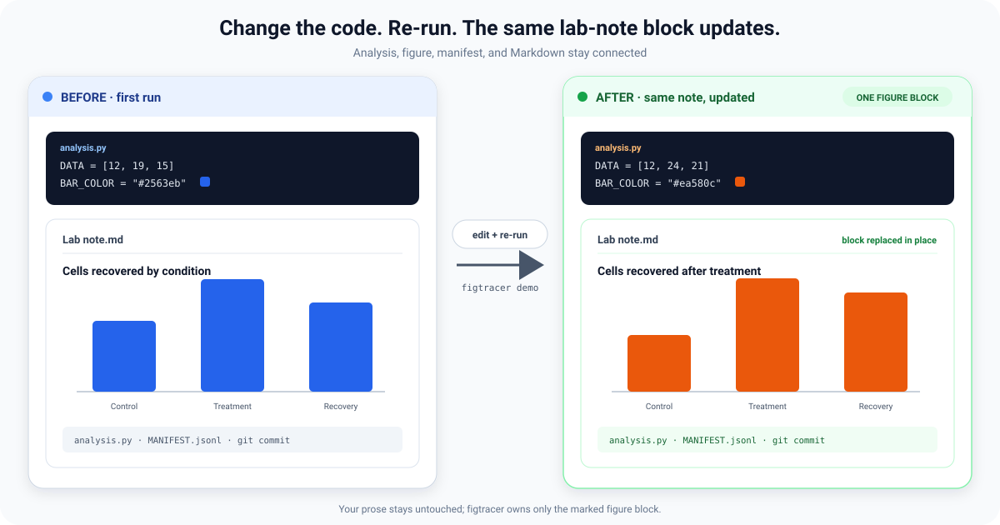
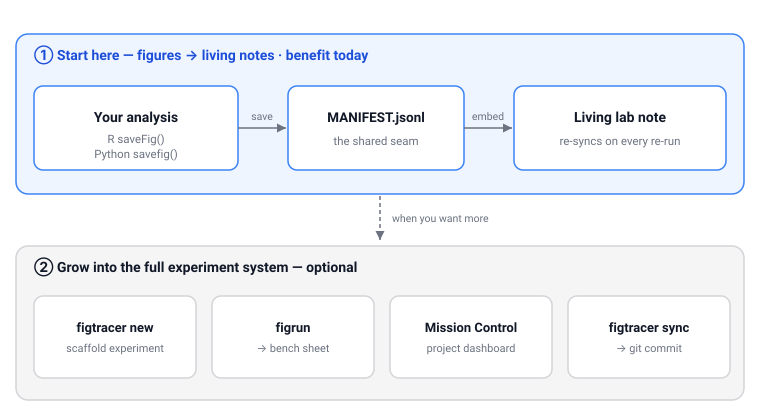

# figtracer

[](https://doi.org/10.5281/zenodo.21288980)
[](https://opensource.org/licenses/MIT)
[](https://github.com/david-priest/figtracer/actions/workflows/ci.yml)

figtracer keeps the figures in a Markdown lab note in step with the R or Python code that made
them. Each figure save appends a line to a manifest recording the figure's title, size, source
file, generator and git commit. A note embeds figures by title, and one command replaces each
embedded figure with its newest render and writes a provenance table beside it.

It exists because the write-up usually lives in a different document from the analysis. A lab
note, an Obsidian vault or a manuscript draft is not rebuilt when the notebook is re-run, so its
figures go stale and nothing reports it. figtracer is the render step for that document.

```bash
uv tool install "git+https://github.com/david-priest/figtracer.git"
figtracer demo
```

Open `figtracer-demo/Lab note.md`, edit the generated `analysis.py`, and run `figtracer demo`
again. The figure in the note changes and the existing block is replaced rather than duplicated.
The demo needs no configuration, vault, project registry, R, external dataset, Chrome or
Matplotlib.



The [five-minute guide](docs/GETTING_STARTED.md) walks through the same loop, and
[`examples/minimal`](examples/minimal) holds a frozen copy of its output.

## How it works

Every figure save, from R, Python or a file registered from another renderer, appends one line to
`MANIFEST.jsonl` in the analysis's `outputs/` folder: the figure's title, size, source file,
generator and the git commit at that moment. The manifest is append-only, so it also holds each
figure's history.

A note embeds a figure by title. `figtracer figsync sync` resolves each embedded title to its
newest render, rasterises it to a stable filename beside the note, and writes a provenance table
listing the source and commit of every figure in the note. After the analysis is re-run, the same
command brings the note up to date without touching its prose. Everything involved is plain text
in git.



The figure loop is one function call in an analysis you already have. Experiment scaffolding,
protocols, a project dashboard and the end-of-session `sync` are a separate layer on top,
described below, and the loop does not depend on them.

## The figure loop

This is the part to try first. It works in an existing analysis with any directory layout, in R
or Python, with notes in any Markdown editor, and needs nothing else from figtracer.

```r
# R — seekit's saveFig(), or figtracer's bundled dependency-free shim (no seekit needed):
source("path/to/figtracer/r/figtracer.R")
saveFig(p, title = "umap_level1")            # -> a figure + a MANIFEST line
```

```python
# Python / Jupyter — same layout, same MANIFEST contract, no R:
from figtracer import savefig
savefig(fig, title = "umap_level1")          # -> a figure + a MANIFEST line
```

```bash
# Existing SVG/PDF/PNG — preserve its source and generator in the same contract:
figtracer fig register method_flow.svg --title fixation_method_flow \
  --source-kind generated-svg --generator "python render_method_flow.py"
```

The figure is then in the manifest, and the note can follow its latest render:

- `figtracer fig embed <spec.yaml>` — compose panels into a figure and write it into a note
  (with a provenance table); `figtracer fig watch` keeps it live.
- `figtracer figsync sync` — keep single note figures in sync with the newest export.
- `figtracer fig doctor` — integrity-check the manifest so a title never resolves to a stale or
  missing figure.

Embeds are standard Markdown or HTML by default, so they render anywhere. `--link-style obsidian`
writes Obsidian wikilinks instead, which carry the native resize handle. A Python analysis
must have `figtracer` installed in its own environment; command-line tools installed by `uv tool`
are intentionally isolated.

[`examples/cytof`](examples/cytof) runs the loop on two public CyTOF datasets, one analysed in R
with `seekit` and one in Python with `scanpy`, and places figures from both in one lab note.

## The full experiment system (optional)

figtracer can also scaffold experiments, render bench protocols, maintain a project dashboard
and close out a session. None of this is needed for the demo or the figure loop.

```text
figtracer new       scaffold a fully cross-linked experiment: notes + data/analysis/outputs dirs
figtracer index     rebuild a project's Mission Control dashboard (every experiment by status)
figtracer figrun    re-render a notebook's figure chunks headlessly, from the .qmd itself
figtracer protocol  call an experiment-local renderer for protocol.yaml (legacy wrapper)
figtracer data      a content-addressed registry of analysis objects (.qs2/.rds/.RData)
figtracer doctor    profile-aware QMD checks for internal, collaborator, and publication views
figtracer sync      end-of-session roundup: figures -> note -> dashboard -> git commit
figtracer export    a clean collaborator-facing PDF of an experiment's notes
```

### Re-rendering figures without reopening the notebook

Change an axis label, a threshold or a colour, and the figure has to be made again. `figrun` does
that from the command line:

```bash
figtracer figrun --exp EXP01 --list          # what the notebook contains, and how each chunk is classified
figtracer figrun --exp EXP01 umap-by-group   # re-render named chunks
figtracer figrun --exp EXP01 --changed       # every render older than the notebook's last edit
figtracer figrun --exp EXP01 --awaiting      # flagged embed=TRUE, but no render on record
```

It executes chunk bodies taken verbatim from the `.qmd`, by label, so it cannot draw anything that
is not already in the notebook. The notebook remains the definition of what the figure is, and
`figrun` only runs it. Prerequisites are worked out by dataflow analysis of the parse tree, so
there is no chunk graph to maintain by hand.

Chunks that rebuild the analysis object itself, such as clustering, embedding, merging and saving
the checkpoint, are skipped unless you name them. Re-running those invalidates every figure drawn
at a level applied afterwards, and can destroy state that no chunk can reproduce, such as gates
drawn by hand in an interactive app.

`figrun` is R-only for now. The R side needs `jsonlite`, `codetools`, `here` and `knitr`. Which
calls count as "rebuilds the object" or "reloads the checkpoint", and how R is launched, are set
in an optional `figrun:` block of `~/.config/labkit/config.yaml`; the defaults are one lab's
idioms (`cluster2`, `qs_save`, `qs_read`, …) and yours will differ:

```yaml
figrun:
  runner: Rscript                      # default: rlog if it is on PATH, else Rscript
  expensive_calls: [runPCA, RunUMAP, FindClusters, saveRDS]
  reload_calls: [readRDS]
```

Follow the [full experiment-system setup](docs/FULL_SYSTEM.md) when you want that layer. The
current protocol command is a bring-your-own-renderer wrapper; packaging a general protocol
renderer remains future work.
`labkit` (scaffolding + Mission Control) and `figtools` (figure assembly) also ship as standalone
console scripts; `figtracer` is a convenience front door over them. The
[analysis doctor](docs/ANALYSIS_DOCTOR.md) gives humans, agents, and CI a named, suppressible
checklist while keeping one detailed internal QMD as the source of truth.

## When figtracer fits

figtracer is a good fit when:

- the write-up lives in a different document from the analysis, such as a Markdown note, an
  Obsidian vault or a manuscript, so no render step keeps its figures current;
- analysis happens in R or Python and figures change as the code changes;
- the durable record should be readable Markdown, YAML, SVG, and JSONL in git;
- figures from multiple scripts or languages need to converge on one note;
- you want to add provenance without moving the analysis into a new notebook platform; or
- stale pasted figures and unclear source files are the recurring problem to solve.

It is not the right primary tool when:

- your figures are generated inline by the document that displays them (a knitted Quarto,
  R Markdown or Jupyter render), which already keeps the figure matched to the code;
- you need regulated ELN controls, electronic signatures, audit certification, or validated
  compliance workflows;
- you need a LIMS for sample inventory, freezer locations, instruments, or chain of custody;
- your team requires a GUI-only, no-code workflow; or
- the analysis and its notes should not live in files or git.

figtracer can sit beside an ELN or LIMS and does not replace them. Its job is to keep
code-generated figures, their provenance and Markdown notes connected.

## Optional: let a coding agent operate it

Everything figtracer touches is plain text, a documented CLI, and git, so a coding agent can run
the same workflow on your behalf. The repository ships [`AGENTS.md`](AGENTS.md) instructions for
that use. Agent operation is optional: every command and artifact remains directly inspectable
and usable by a person at the terminal.

## Install notes

The quick start installs the CLI with `uv tool`. Update it later with:

```bash
uv tool upgrade figtracer
```

For `from figtracer import savefig`, install the package into the environment that runs your
Python analysis too. See the [five-minute guide](docs/GETTING_STARTED.md) for a local-clone
example.

## Development

```bash
git clone https://github.com/david-priest/figtracer.git
cd figtracer
python3 -m venv .venv
source .venv/bin/activate
pip install -e ".[dev]"
pytest
```

## Layout

```text
figtracer/      umbrella package (CLI, sync, protocol, savefig, data, export)
labkit/         experiment scaffolding + Mission Control + ingest (+ templates, config)
figtools/       figure assembly, embed, and integrity checks
r/              dependency-free R saveFig() shim
examples/       minimal zero-data demo snapshot + public-data CyTOF example
docs/           five-minute start, optional full setup, and subsystem guides
```

## License

MIT — see [`LICENSE`](LICENSE).

## Acknowledgements

Developed in the Wing Lab at the Center for Infectious Disease Education and Research
(CIDER), Osaka University.
