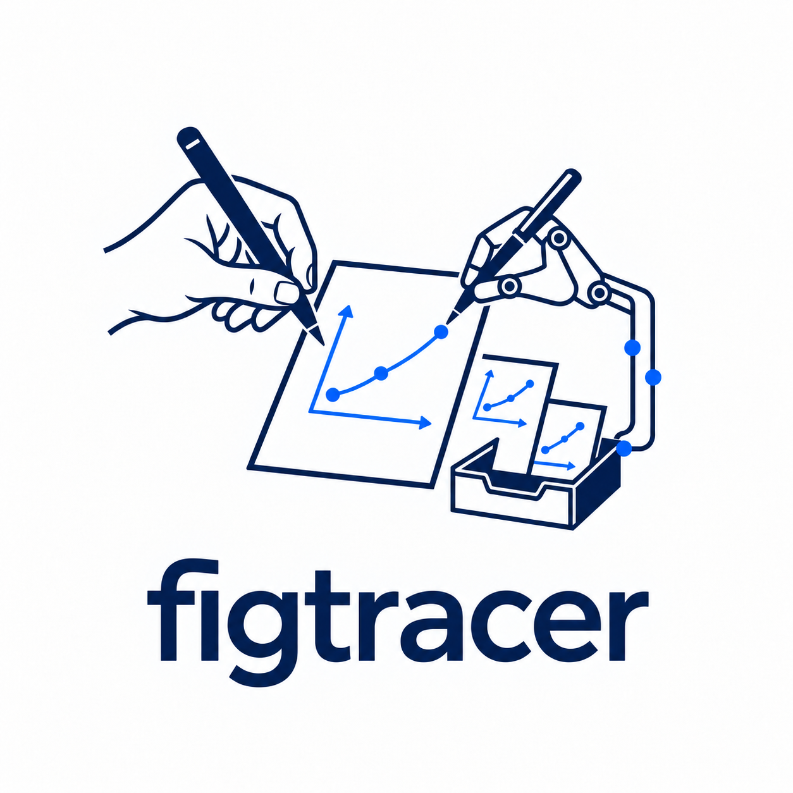
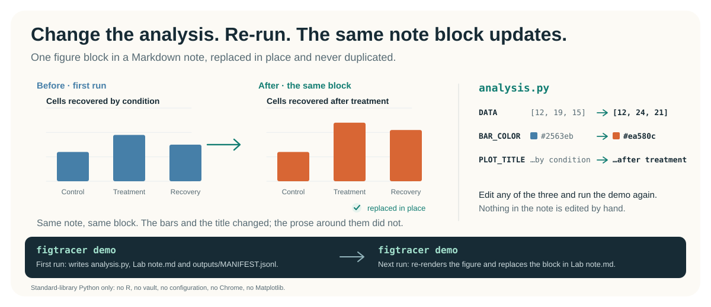

<h1 align="center">
  
</h1>

<p align="center"><b>Keep your lab notes in step with your analysis.</b></p>

<p align="center">Sync figures and tables from R or Python into Markdown notes, trace them to their source, and check the numbers in your write-up.</p>

<p align="center">
  <a href="https://doi.org/10.5281/zenodo.21288980"></a>
  <a href="LICENSE"></a>
  <a href="https://github.com/david-priest/figtracer/actions/workflows/ci.yml"></a>
  <a href="#the-figure-loop"></a>
  <a href="#how-it-works"></a>
  <a href="#optional-let-a-coding-agent-operate-it"></a>
</p>

<p align="center">
  <a href="docs/GETTING_STARTED.md"></a>
</p>

<p align="center">
  <a href="docs/GETTING_STARTED.md"><b>Get started</b></a> · <a href="#how-it-works">How it works</a> · <a href="#optional-let-a-coding-agent-operate-it">Use with a coding agent</a>
</p>

figtracer keeps a Markdown lab note in step with the R or Python analysis behind it. It does three things.

Figures and tables reach the note through a manifest. Each save appends one line recording the title, the notebook and chunk, and the git commit. The note embeds by title, and `figtracer figsync sync` replaces every embedded figure and table with its newest version and writes a provenance index beside the note.

Figures are re-rendered from the notebook. `figtracer figrun` executes a notebook's figure chunks headlessly, by label, so a changed colour, threshold or axis label is drawn again without reopening the session. It runs chunk bodies verbatim, so it cannot draw anything the notebook does not define.

Numbers in the note are checked against the outputs. `figtracer notecheck` reports every number in a note that no current chunk, saved table or ledger produced, and names the chunk that last produced it.

It exists because the write-up usually lives in a different document from the analysis. A lab note, an Obsidian vault or a manuscript draft is not rebuilt when the notebook is re-run, so its figures go stale and its numbers drift, and nothing reports either. figtracer is the render step and the check for that document.


```bash
uv tool install "git+https://github.com/david-priest/figtracer.git"
figtracer demo
```

Open `figtracer-demo/Lab note.md`, edit the generated `analysis.py`, and run `figtracer demo`
again. The figure in the note changes and the existing block is replaced rather than duplicated.
The demo needs no configuration, vault, project registry, R, external dataset, Chrome or
Matplotlib.



The [five-minute guide](docs/GETTING_STARTED.md) walks through the same loop, and
[`examples/minimal`](examples/minimal) holds a frozen copy of its output.

## How it works

Every figure or table save, from R, Python or a file registered from another renderer, appends one line to `MANIFEST.jsonl` in the analysis's `outputs/` folder: the title, the notebook and chunk that made it, the git commit at that moment, and for a figure its size. The manifest is append-only, so it also holds each artefact's history. The contract is written down in [docs/MANIFEST.md](docs/MANIFEST.md).

A note embeds a figure by title. `figtracer figsync sync` resolves each embedded title to its newest render, rasterises it to a stable filename beside the note, regenerates every placed table from its CSV, and writes a provenance index listing the source and commit of everything in the note. After the analysis is re-run, the same command brings the note up to date without touching its prose, and `figsync drift` reports any embed whose attachment is older than the newest render.

Two commands run the loop in the other direction. `figrun` takes an edit to the notebook back to a render, and `notecheck` takes a number in the note back to the chunk that produced it.


The figure loop is one function call in an analysis you already have. `figrun` and `notecheck` need an experiment the registry knows about, since they resolve the notebook and the outputs through the experiment's note. Experiment scaffolding, a project dashboard and the end-of-session `sync` are a separate layer on top, described below.

## The figure loop

This is the part to try first. It works in an existing analysis with any directory layout, in R
or Python, with notes in any Markdown editor, and needs nothing else from figtracer.

```r
# R — seekit's saveFig(), or figtracer's bundled dependency-free shim (no seekit needed):
source("path/to/figtracer/r/figtracer.R")
saveFig(p, title = "umap_level1")            # -> a figure + a MANIFEST line
```

```python
# Python / Jupyter — same layout, same MANIFEST contract, no R:
from figtracer import savefig
savefig(fig, title = "umap_level1")          # -> a figure + a MANIFEST line
```

```bash
# Existing SVG/PDF/PNG — preserve its source and generator in the same contract:
figtracer fig register method_flow.svg --title fixation_method_flow \
  --source-kind generated-svg --generator "python render_method_flow.py"
```

The figure is then in the manifest, and the note can follow its latest render:

- `figtracer figsync place <title> --note <note> -y` — write the embed into a note, in Markdown,
  HTML or Obsidian wikilink form.
- `figtracer figsync sync` — rasterise the newest render of every embedded title to its stable
  attachment, and rewrite the provenance index.
- `figtracer figsync drift` — report embeds that are stale, not yet materialised, or have no
  registered source.
- `figtracer fig embed <spec.yaml>` — compose panels into a multipanel figure and write it into a
  note; `figtracer fig watch` keeps it live. `figtracer fig doctor` integrity-checks the manifest.

Embeds are standard Markdown or HTML by default, so they render anywhere. `--link-style obsidian`
writes Obsidian wikilinks instead, which carry the native resize handle. A Python analysis
must have `figtracer` installed in its own environment; command-line tools installed by `uv tool`
are intentionally isolated.

[`examples/cytof`](examples/cytof) runs the loop on two public CyTOF datasets, one analysed in R
with `seekit` and one in Python with `scanpy`, and places figures from both in one lab note.

## Re-rendering from the notebook

Change an axis label, a threshold or a colour, and the figure has to be made again. `figrun` does that from the command line, from the `.qmd` itself.


```bash
figtracer figrun --exp EXP01 --list          # what the notebook holds, and how each chunk is classified
figtracer figrun --exp EXP01 umap-by-group   # re-render named chunks
figtracer figrun --exp EXP01 --changed       # every figure chunk whose newest render predates the notebook's last edit
figtracer figrun --exp EXP01 --awaiting      # figure chunks flagged for a note that have no render on record
```

It executes chunk bodies taken verbatim from the `.qmd`, by label, so it cannot draw anything that is not already in the notebook. The notebook remains the definition of what the figure is, and `figrun` only runs it. Prerequisites are worked out by dataflow analysis of the parse tree, so there is no chunk graph to maintain by hand, and figure calls in prerequisite chunks are muted, so nothing re-renders by accident.

Chunks that rebuild the analysis object itself, such as clustering, embedding, merging and saving the checkpoint, are skipped unless you name them. Re-running those invalidates every figure drawn at a level applied afterwards, and can destroy state that no chunk can reproduce, such as gates drawn by hand in an interactive app. The chunk that reloads the saved object is run even when the notebook marks it `eval: false`, because headlessly it is the only source of the object.

Each render is verified before success is reported: the new manifest line must sit under this experiment's `outputs/`, point at this notebook, carry the chunk label, and refer to a file that is not a blank device. The chunk label is stamped into the manifest line, which is what makes `--changed` exact for figures whose titles are built at run time.

`figrun` is R-only for now, and resolves the notebook through the experiment's note (`--qmd` picks among several). The R side needs `jsonlite`, `codetools`, `here` and `knitr`. Which calls count as "rebuilds the object" or "reloads the checkpoint", and how R is launched, are set in an optional `figrun:` block of `~/.config/labkit/config.yaml`; the defaults are one lab's idioms (`cluster2`, `qs_save`, `qs_read`, …) and yours will differ:

```yaml
figrun:
  runner: Rscript                      # default: rlog if it is on PATH, else Rscript
  expensive_calls: [runPCA, RunUMAP, FindClusters, saveRDS]
  reload_calls: [readRDS]
```

## Numbers and tables

A figure in a note has a manifest line behind it. A number typed into the prose, or a table typed in by hand, has nothing, and it is the number that goes wrong: a value copied from an earlier run, a confidence bound hand-computed and off by one unit, two table rows transposed. `notecheck` and `saveTable()` close that gap.

A table is saved like a figure and becomes a first-class artefact. `saveTable(df, "cluster_medians")` in R or `savetable(df, "cluster_medians")` in Python writes `outputs/cluster_medians.csv`, overwritten in place, and a manifest line with `kind: table`. `figtracer figsync place cluster_medians --table --note <note> -y` writes the table into the note between markers, and `figsync sync` regenerates the block whenever the CSV changes, leaving the prose around it alone.

`figtracer notecheck --exp EXP01` then checks every number in the experiment's notes against what the analysis currently produces: the saved tables, each chunk's console output from the newest run that ran it, and the experiment's protocol and run ledgers. A number nothing current produced is reported as unsourced; one that an earlier run produced and the current one does not is reported as stale, with the run that last produced it. Years, identifiers such as PMIDs and catalogue numbers, a note's dated `# Log` and planning notes are exempt. `figtracer sync` runs the check before it commits and stops on findings.

```bash
figtracer notecheck --exp EXP01                 # report
figtracer notecheck --exp EXP01 --where 0.954   # which chunk, table or ledger produced this value
figtracer notecheck --exp EXP01 --json --attribute   # every sourced number with its source, for an agent or CI
```

The console corpus reads an append-only R session log in the format `seekit`'s `start_session_log()` writes, one block per run with a marker per chunk; `figrun` writes those markers, and a knit does too.

## The full experiment system (optional)

figtracer can also scaffold experiments, track the acquisitions inside one, maintain a project dashboard and close out a session. None of this is needed for the demo or the figure loop.

```text
figtracer new       scaffold a fully cross-linked experiment: note + protocol/data/analysis/outputs dirs
figtracer run       one acquisition inside an experiment: run.yaml ledger + a Runs table in the note
figtracer index     rebuild a project's Mission Control dashboard (every experiment by status)
figtracer data      a content-addressed registry of analysis objects (.qs2/.rds/.RData)
figtracer doctor    profile-aware QMD checks for internal, collaborator, and publication views
figtracer sync      end-of-session roundup: figures and tables -> note -> notecheck -> dashboard -> git commit
figtracer export    a clean collaborator-facing PDF of an experiment's notes
```

Follow the [full experiment-system setup](docs/FULL_SYSTEM.md) when you want that layer, and
[docs/RUNS.md](docs/RUNS.md) for experiments with more than one acquisition.
Bench protocols moved to a separate repository, protokit, on 2026-09-02; `figtracer protocol`
forwards to it for one release.
`labkit` (scaffolding + Mission Control) and `figtools` (figure assembly) also ship as standalone
console scripts; `figtracer` is a convenience front door over them. The
[analysis doctor](docs/ANALYSIS_DOCTOR.md) gives humans, agents, and CI a named, suppressible
checklist while keeping one detailed internal QMD as the source of truth.

## When figtracer fits

figtracer is a good fit when:

- the write-up lives in a different document from the analysis, such as a Markdown note, an
  Obsidian vault or a manuscript, so no render step keeps its figures current;
- analysis happens in R or Python and figures change as the code changes;
- the durable record should be readable Markdown, YAML, SVG, and JSONL in git;
- figures from multiple scripts or languages need to converge on one note;
- the numbers quoted in a note need to be traceable to the run that produced them;
- you want to add provenance without moving the analysis into a new notebook platform; or
- stale pasted figures and unclear source files are the recurring problem to solve.

It is not the right primary tool when:

- your figures are generated inline by the document that displays them (a knitted Quarto,
  R Markdown or Jupyter render), which already keeps the figure matched to the code;
- you need regulated ELN controls, electronic signatures, audit certification, or validated
  compliance workflows;
- you need a LIMS for sample inventory, freezer locations, instruments, or chain of custody;
- your team requires a GUI-only, no-code workflow; or
- the analysis and its notes should not live in files or git.

figtracer can sit beside an ELN or LIMS and does not replace them. Its job is to keep
code-generated figures, their provenance and Markdown notes connected.

## Optional: let a coding agent operate it

Everything figtracer touches is plain text, a documented CLI, and git, so a coding agent can run
the same workflow on your behalf. The repository ships [`AGENTS.md`](AGENTS.md) instructions for
that use. Agent operation is optional: every command and artifact remains directly inspectable
and usable by a person at the terminal.

## Install notes

The quick start installs the CLI with `uv tool`. Update it later with:

```bash
uv tool upgrade figtracer
```

For `from figtracer import savefig`, install the package into the environment that runs your
Python analysis too. See the [five-minute guide](docs/GETTING_STARTED.md) for a local-clone
example.

## Development

```bash
git clone https://github.com/david-priest/figtracer.git
cd figtracer
python3 -m venv .venv
source .venv/bin/activate
pip install -e ".[dev]"
pytest
```

## Layout

```text
figtracer/      umbrella package (CLI, figsync, figrun, notecheck, sync, savefig, savetable, data, export)
labkit/         experiment scaffolding + Mission Control + ingest (+ templates, config)
figtools/       figure assembly, embed, and integrity checks
r/              dependency-free R saveFig() shim
examples/       minimal zero-data demo snapshot + public-data CyTOF example
docs/           five-minute start, optional full setup, and subsystem guides
```

## License

MIT — see [`LICENSE`](LICENSE).

## Acknowledgements

Developed in the Wing Lab at the Center for Infectious Disease Education and Research
(CIDER), Osaka University.
