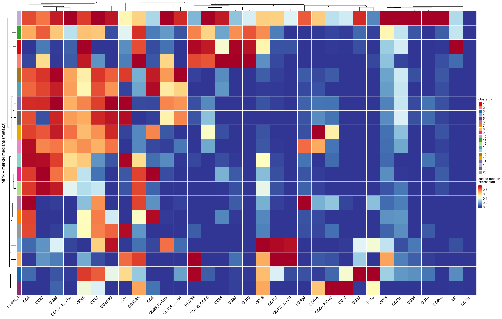
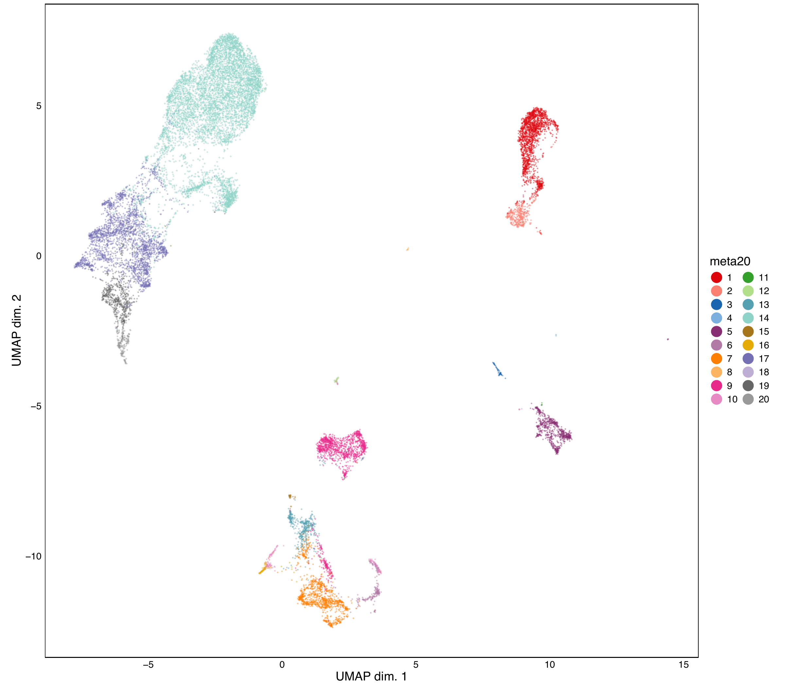
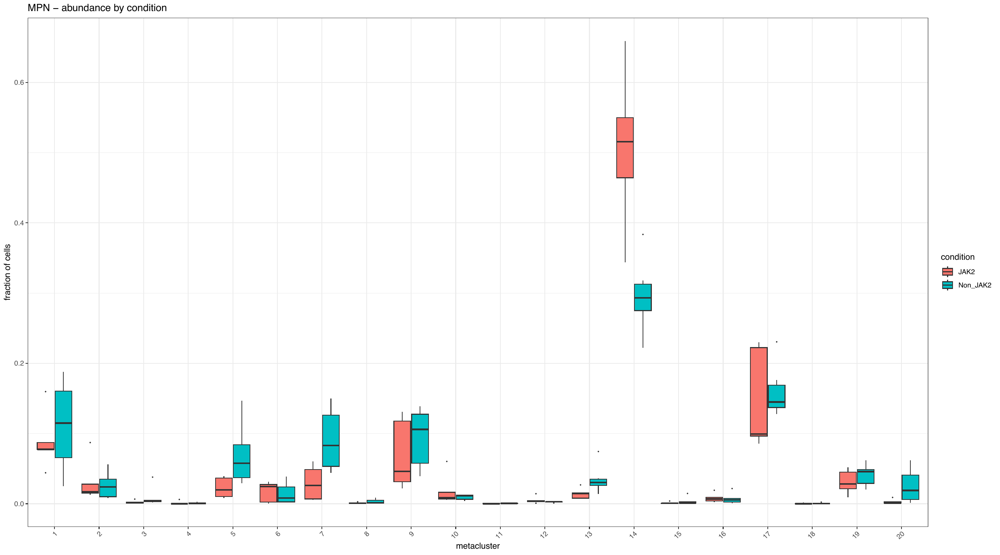
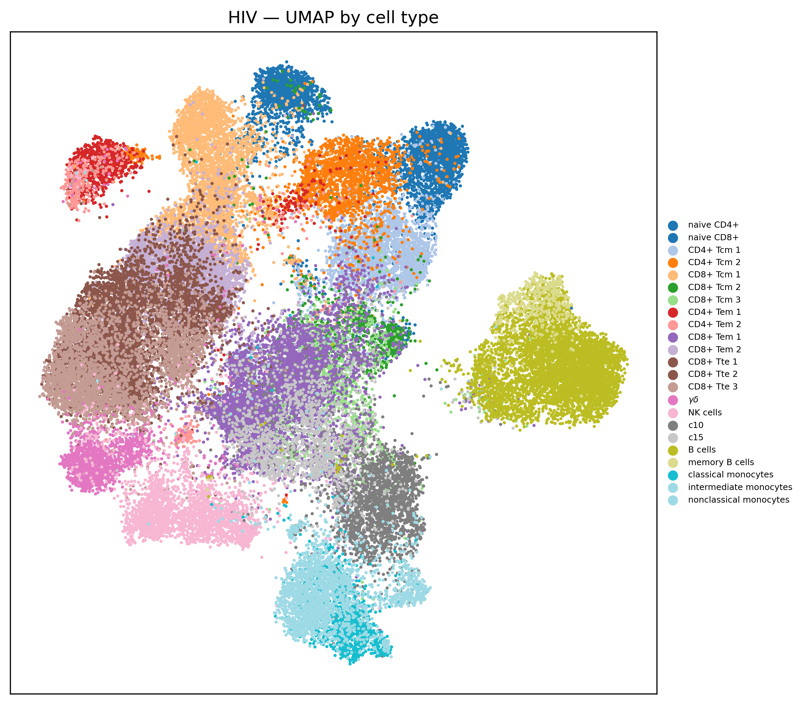
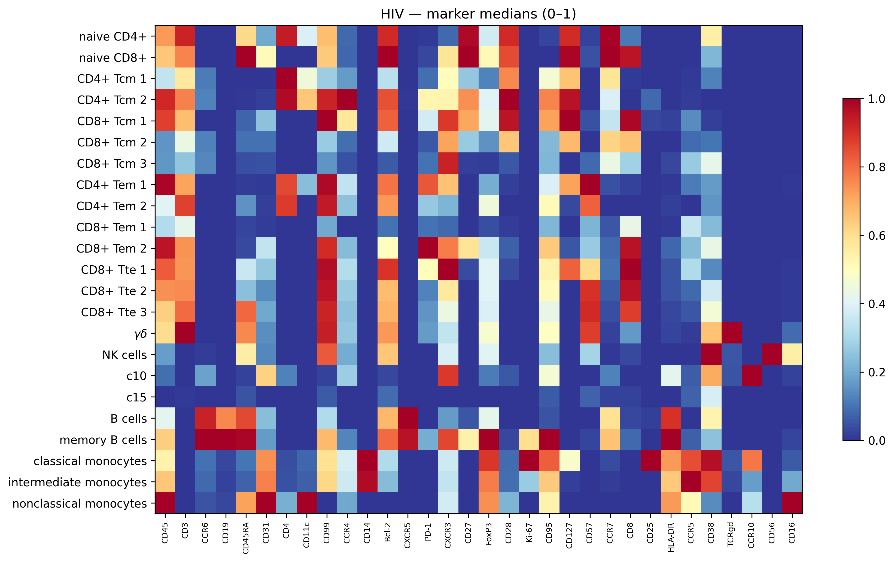
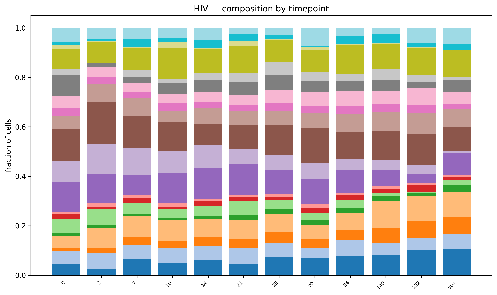

# CyTOF cross-language example — one note, two languages

> [!info] Assembled by figtracer from figures produced in **R** (`seekit`) and **Python**
> (`scanpy`), on two public CyTOF datasets. Each figure links back to the script and the
> exact git commit that made it (see **Provenance**). Re-running either analysis re-exports
> its figures and this note updates itself — the note is a *derived view*, not a hand-paste.

See `../DATASETS.md` for data sources, citations, and licences.

## MPN — R / seekit

*Data: MPN PBMC (Zenodo 7982165). Source: `mpn_seekit.qmd`.*

### mpn_heatmap_meta20

*Marker medians per FlowSOM metacluster (meta20).*

### mpn_umap_meta20

*UMAP coloured by metacluster.*

### mpn_abundance_by_condition

*Metacluster abundance by condition (JAK2 vs Non_JAK2).*

## HIV — Python / scanpy

*Data: HIV PBMC (Zenodo 7986013). Source: `hiv_scanpy.py`.*

### hiv_umap_celltype

*UMAP coloured by pre-annotated cell type.*

### hiv_marker_heatmap

*Marker medians (0–1) per cell type.*

### hiv_abundance_by_timepoint

*Cell-type composition by post-ART timepoint.*

## Provenance

| figure | source | git commit | saved |
| --- | --- | --- | --- |
| `mpn_heatmap_meta20` | `mpn_seekit.qmd` | `6039cec5f394` | 2026-07-09T18:56:03 |
| `mpn_umap_meta20` | `mpn_seekit.qmd` | `6039cec5f394` | 2026-07-09T18:56:18 |
| `mpn_abundance_by_condition` | `mpn_seekit.qmd` | `6039cec5f394` | 2026-07-09T18:56:18 |
| `hiv_umap_celltype` | `hiv_scanpy.py` | `6039cec5f394` | 2026-07-09T19:00:19 |
| `hiv_marker_heatmap` | `hiv_scanpy.py` | `6039cec5f394` | 2026-07-09T19:00:19 |
| `hiv_abundance_by_timepoint` | `hiv_scanpy.py` | `6039cec5f394` | 2026-07-09T19:00:20 |
