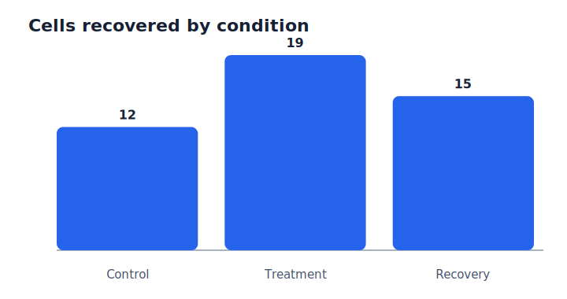

# Demo lab note

This paragraph is ordinary Markdown. figtracer only updates the marked figure block below.

<!-- figtracer:demo_cell_counts START -->
## Figure: Cells recovered by condition

_Updated from `analysis.py`._

**Provenance**

| figure | analysis source | manifest | git commit |
|---|---|---|---|
| `demo_cell_counts` | `analysis.py` | `example-output/MANIFEST.jsonl` | `a1b2c3d4e5f6` |
<!-- figtracer:demo_cell_counts END -->
